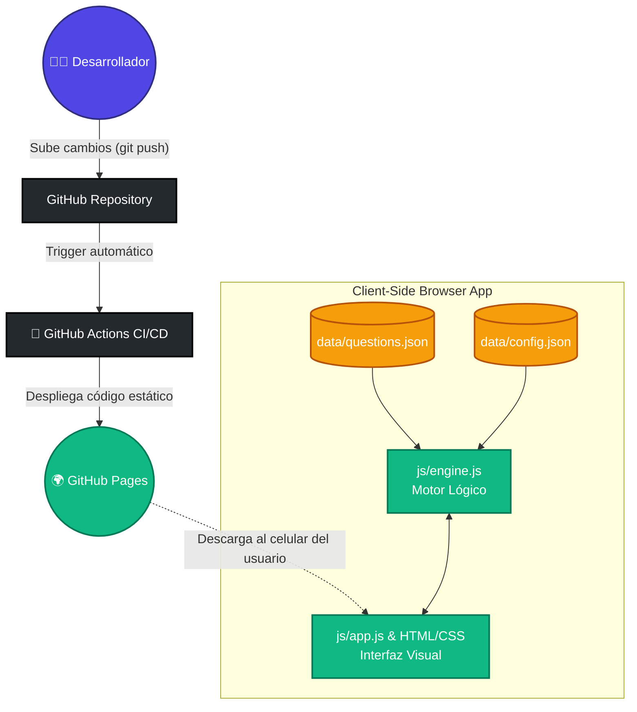

<div align="center">
  
# 🚗 Simulador de Examen Teórico de Conducir

**Municipalidad de Córdoba - Conductores particulares _Primera vez_ y _Renovación_ (Autos y Motos)**

[](https://es.wikipedia.org/wiki/HTML5)
[](https://es.wikipedia.org/wiki/CSS)
[](https://developer.mozilla.org/es/docs/Web/JavaScript)
[](https://pages.github.com/)
[](https://opensource.org/licenses/MIT)

Una aplicación web estática, responsiva y ultrarrápida para practicar y asegurar tu éxito en el examen teórico.

👉 **[¡Comenzar a practicar online ahora!](https://marquezjose.github.io/practica-carnet-conducir/)** 👈

---

</div>

> [!WARNING]
> **AVISO LEGAL:** Esta aplicación es un proyecto personal, de código abierto y sin fines de lucro. **NO ES OFICIAL** y no está afiliada, avalada ni patrocinada por la Municipalidad de Córdoba ni por ningún ente gubernamental. El material de estudio ("preguntero") utilizado es de dominio público, pero esta herramienta se provee "tal cual" (_as is_) exclusivamente para fines educativos personales. No se garantiza la exactitud absoluta de las preguntas respecto al examen real vigente. Se recomienda siempre consultar la [documentación oficial de la Municipalidad de Córdoba](https://www.cordoba.gob.ar).

## ✨ Características Principales

- 🌍 **Acceso Online Inmediato:** Alojada en GitHub Pages. Estudia desde cualquier celular, tablet o PC sin instalar absolutamente nada.
- 🔒 **Privacidad Total (100% Client-Side):** Todo se procesa en la memoria RAM de tu dispositivo. No hay bases de datos en la nube que recopilen tu información personal.
- 🧠 **Modos de Estudio:**
  - **Práctica Libre:** Responde preguntas del banco de forma aleatoria con _feedback_ visual inmediato y gráficos explicativos.
  - **Simulación de Examen:** Un entorno cronometrado y estructurado igual al real (30 preguntas, requiere 90% para aprobar).
- 🎨 **Diseño Moderno (Glassmorphism):** Interfaz premium en Modo Oscuro, con animaciones fluidas y tipografía diseñada para evitar la fatiga visual durante largas sesiones de estudio.
- 🤖 **CI/CD Automático:** Integración continua; el contenido se actualiza en vivo cada vez que se modifican los archivos fuente.

---

## 🏗️ Arquitectura y Flujo de Trabajo

El sistema está diseñado para ser extremadamente robusto y barato (costo cero) de mantener. Funciona dividiendo la capa de datos de la capa visual, lo que permite que el despliegue a la web sea instantáneo.



---

## 🚀 Cómo usarla

### Opción 1: Estudiante (Online) - _Recomendado_

Simplemente ingresa desde el navegador de tu celular o computadora al siguiente enlace público y comienza a responder:
👉 **[Acceder a la Aplicación Web](https://marquezjose.github.io/practica-carnet-conducir/)**

### Opción 2: Desarrollador (Entorno Local)

Si deseas modificar el código o agregar preguntas:

1. Clona este repositorio en tu computadora: `git clone https://github.com/marquezjose/practica-carnet-conducir.git`
2. Abre la carpeta del proyecto.
3. Inicia un servidor web local (por ejemplo, con Python):
   ```bash
   python3 -m http.server 8000
   ```
4. Abre `http://localhost:8000` en tu navegador web.

---

## 📝 Cómo actualizar el banco de preguntas

La lógica del motor es independiente de las preguntas. Para agregar o modificar preguntas de la normativa, edita el archivo `data/questions.json` respetando esta estructura:

```json
{
  "id": 1,
  "question": "¿Quién tiene prioridad en una rotonda?",
  "options": ["El que ingresa.", "El que circula por la misma."],
  "correctAnswerIndex": 1,
  "image": "data/img/q1.png"
}
```

_Nota: El campo `image` es opcional si la pregunta no lleva ilustración gráfica. `correctAnswerIndex` es el índice de la respuesta correcta (empieza a contar desde el cero)._

Para alterar los requisitos de aprobación del simulacro, modifica los parámetros en `data/config.json`.
